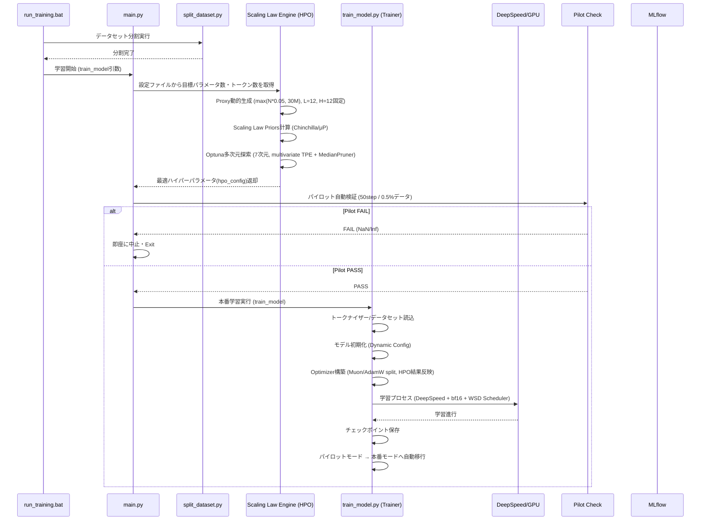

# 学習シーケンス図

```mermaid
sequenceDiagram
    participant B as run_training.bat
    participant M as main.py
    participant S as split_dataset.py
    participant H as Scaling Law Engine (HPO)
    participant T as train_model.py (Trainer)
    participant D as DeepSpeed/GPU
    participant P as Pilot Check
    participant ML as MLflow

    B->>S: データセット分割実行
    S-->>B: 分割完了
    B->>M: 学習開始 (train_model引数)
    M->>H: 設定ファイルから目標パラメータ数・トークン数を取得
    H->>H: Proxy動的生成 (max(N*0.05, 30M), L=12, H=12固定)
    H->>H: Scaling Law Priors計算 (Chinchilla/μP)
    H->>H: Optuna多次元探索 (7次元, multivariate TPE + MedianPruner)
    H-->>M: 最適ハイパーパラメータ(hpo_config)返却
    M->>P: パイロット自動検証 (50step / 0.5%データ)
    alt Pilot FAIL
        P-->>M: FAIL (NaN/Inf)
        M->>M: 即座に中止・Exit
    else Pilot PASS
        P-->>M: PASS
        M->>T: 本番学習実行 (train_model)
        T->>T: トークナイザー/データセット読込
        T->>T: モデル初期化 (Dynamic Config)
        T->>T: Optimizer構築 (Muon/AdamW split, HPO結果反映)
        T->>D: 学習プロセス (DeepSpeed + bf16 + WSD Scheduler)
        D-->>T: 学習進行
        T->>T: チェックポイント保存
        T->>T: パイロットモード → 本番モードへ自動移行
    end
```