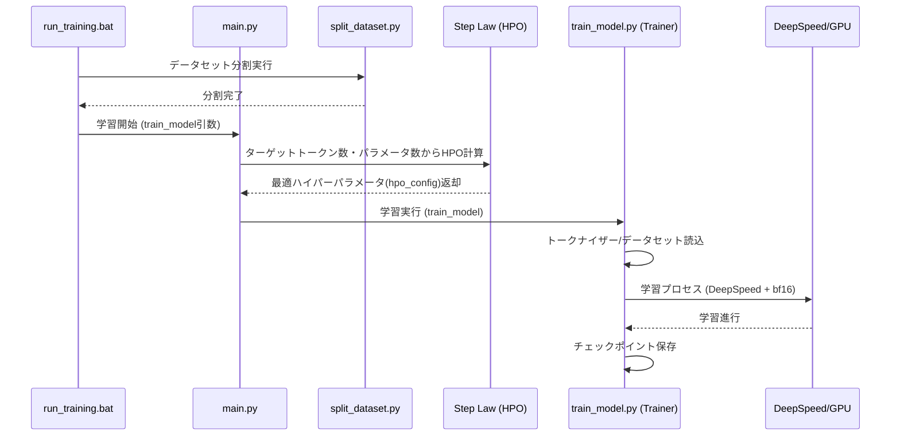

# 学習シーケンス図

```mermaid
sequenceDiagram
    participant B as run_training.bat
    participant M as main.py
    participant S as split_dataset.py
    participant H as Step Law (HPO)
    participant T as train_model.py (Trainer)
    participant D as DeepSpeed/GPU

    B->>S: データセット分割実行
    S-->>B: 分割完了
    B->>M: 学習開始 (train_model引数)
    M->>H: ターゲットトークン数・パラメータ数からHPO計算
    H-->>M: 最適ハイパーパラメータ(hpo_config)返却
    M->>T: 学習実行 (train_model)
    T->>T: トークナイザー/データセット読込
    T->>D: 学習プロセス (DeepSpeed + bf16)
    D-->>T: 学習進行
    T->>T: チェックポイント保存
```
