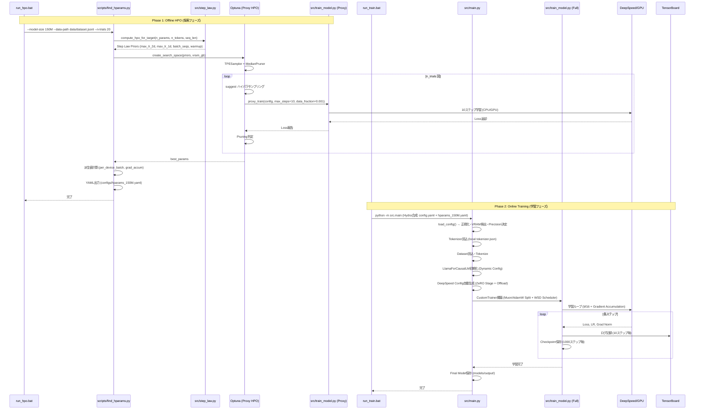

# 学習シーケンス図

## 説明

### Phase 1: Offline HPO (探索フェーズ)
- **完全分離**: 学習コード(`src/main.py`, `src/train_model.py`)は `optuna` を import しない
- **Step Law Prior**: Chinchilla則(LR ∝ N^-0.713) + μP則(2D/1D LR分離)から探索中心を決定
- **プロキシ学習**: 10ステップ、データ0.1%で高速評価 (1試行約30秒 on CPU)
- **成果物**: `configs/hparams_<SIZE>.yaml` をGit管理

### Phase 2: Online Training (学習フェーズ)
- **即時開始**: 起動から学習開始まで10秒以内 (探索・計算なし)
- **Hydra合成**: `config.yaml` (ベース+アーキテクチャ) + `hparams_150M.yaml` (最適HP) = 実行時設定
- **VRAM自動適応**: `torch.cuda.get_device_properties()` → ZeRO Stage自動決定
- **依存最小**: `torch`, `transformers`, `datasets`, `accelerate`, `deepspeed`, `tensorboard` のみ