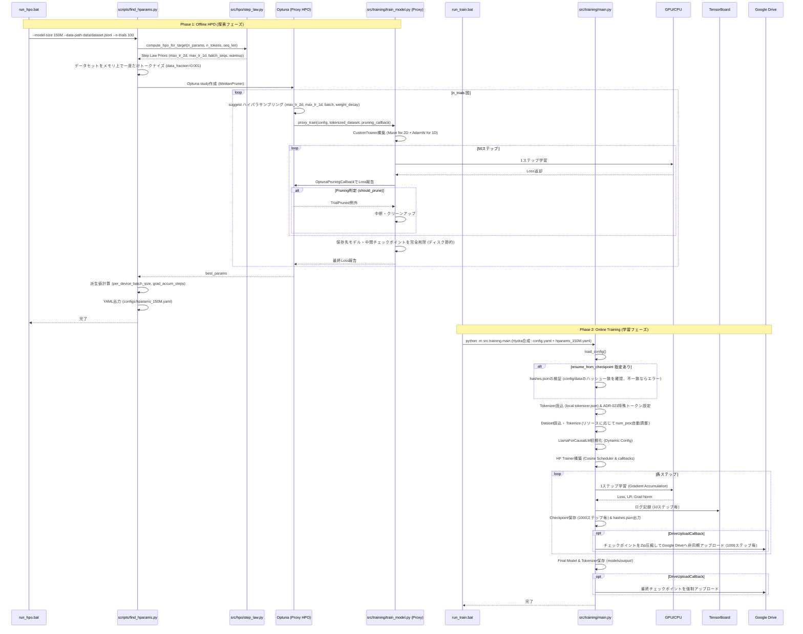

# 学習シーケンス図

## 説明

### Phase 1: Offline HPO (探索フェーズ)
- **完全分離**: 本番学習コード(`src/training/main.py`)は `optuna` を依存・import しない
- **Step Law Prior**: Chinchilla則(LR ∝ N^-0.713) + μP則(2D/1D LR分離)から探索中心を決定
- **効率的トークナイズ**: 各試行ごとではなく、最適化開始前にメモリ上でデータセットのトークナイズを一括で実行
- **プロキシ学習**: `src/training/train_model.py` 内の `CustomTrainer` を用いて、50ステップ、データ0.1%で高速評価
- **オプティマイザ分割**: 2Dパラメータには `Muon` (ない場合は `AdamW`)、1Dパラメータには `AdamW` を適用
- **自動クリーンアップ**: 試行ごとにディスクを圧迫するチェックポイントや出力を完全削除
- **成果物**: `configs/hparams_<SIZE>.yaml` を出力しGit管理

### Phase 2: Online Training (学習フェーズ)
- **即時開始**: 起動から学習開始まで高速
- **整合性検証 (ADR)**: チェックポイントから再開する際、`hashes.json` に保存された config とデータセットの SHA256 ハッシュを検証し、変更があればエラーで処理を中断
- **Hydra合成**: `config.yaml` (人間編集) + `hparams_150M.yaml` (最適ハイパラ) = 実行時設定
- **Tokenizer**: ローカルの `tokenizer.json` から直接読み込み、ADR-021に基づき SP-native トークン名 (IDs 0-3) を手動設定
- **リソース自動調整**: CPUコア数および空きRAM容量から最適なデータ処理プロセス数 `num_proc` を動的算出
- **Trainer**: 標準の Hugging Face `Trainer` と `Cosine` スケジューラを使用して本番学習を実行
- **定期バックアップ**: `DriveUploadCallback` により、1000ステップごとにチェックポイントをzip圧縮して Google Drive に非同期アップロード
- **依存最小**: `torch`, `transformers`, `datasets`, `tensorboard` のみ (DeepSpeed/Muonは環境に応じて利用)