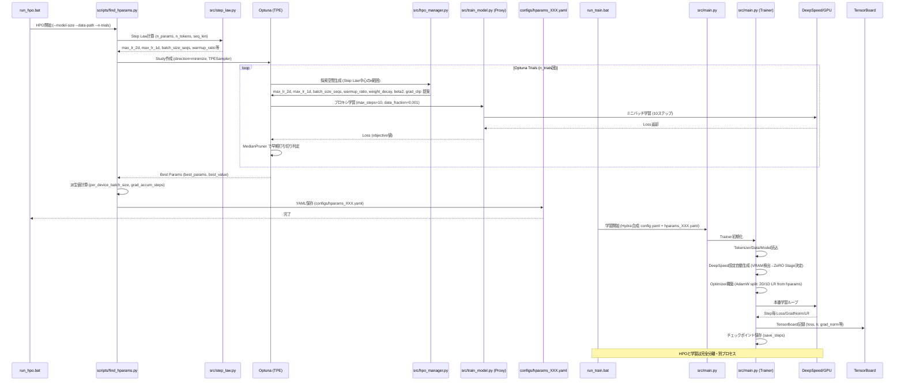

# 学習シーケンス図

```mermaid
sequenceDiagram
    participant B as run_hpo.bat
    participant H as scripts/find_hparams.py
    participant SL as src/step_law.py
    participant O as Optuna (TPE)
    participant P as src/hpo_manager.py
    participant T as src/train_model.py (Proxy)
    participant Y as configs/hparams_XXX.yaml
    participant R as run_train.bat
    participant M as src/main.py
    participant TR as src/main.py (Trainer)
    participant D as DeepSpeed/GPU
    participant TB as TensorBoard

    %% Phase 1: Offline HPO
    B->>H: HPO開始 (--model-size --data-path --n-trials)
    H->>SL: Step Law計算 (n_params, n_tokens, seq_len)
    SL-->>H: max_lr_2d, max_lr_1d, batch_size_seqs, warmup_ratio等
    H->>O: Study作成 (direction=minimize, TPESampler)
    
    loop Optuna Trials (n_trials回)
        O->>P: 探索空間生成 (Step Law中心の±範囲)
        P->>O: max_lr_2d, max_lr_1d, batch_size_seqs, warmup_ratio, weight_decay, beta2, grad_clip 提案
        O->>T: プロキシ学習 (max_steps=10, data_fraction=0.001)
        T->>D: ミニバッチ学習 (10ステップ)
        D-->>T: Loss返却
        T-->>O: Loss (objective値)
        O->>O: MedianPruner で早期打ち切り判定
    end
    
    O-->>H: Best Params (best_params, best_value)
    H->>H: 派生値計算 (per_device_batch_size, grad_accum_steps)
    H->>Y: YAML保存 (configs/hparams_XXX.yaml)
    Y-->>B: 完了

    %% Phase 2: Training (separate invocation)
    R->>M: 学習開始 (Hydra合成: config.yaml + hparams_XXX.yaml)
    M->>TR: Trainer初期化
    TR->>TR: Tokenizer/Data/Model読込
    TR->>TR: DeepSpeed設定自動生成 (VRAM検出→ZeRO Stage決定)
    TR->>TR: Optimizer構築 (AdamW split: 2D/1D LR from hparams)
    TR->>D: 本番学習ループ
    D-->>TR: Step毎 Loss/GradNorm/LR
    TR->>TB: TensorBoard記録 (loss, lr, grad_norm等)
    TR->>TR: チェックポイント保存 (save_steps)
    
    Note over R,D: HPOと学習は完全分離・別プロセス
```