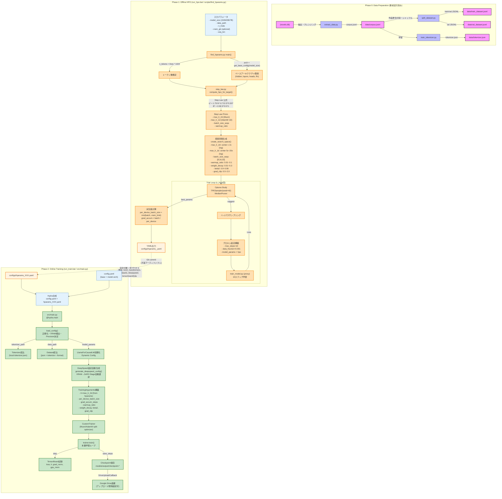

# 詳細なフローチャート図

本システムにおける**「オフラインHPO（探索フェーズ）」→「オンライン学習フェーズ」**の二段階構成、Step Lawに基づく探索空間構築、プロキシ学習による多次元最適化、Hydra設定合成による学習即時実行までの全ライフサイクルを表したフローチャートです。



---

## 凡例・色分け

| 色 | 意味 |
|---|---|
| 🟦 青 | 通常プロセス |
| 🟧 オレンジ | **HPOフェーズ** (optuna依存、開発時のみ実行) |
| 🟩 緑 | **学習フェーズ** (本番依存のみ、即時実行) |
| 🟨 黄 | 成果物・アーティファクト (Git管理) |
| 🟪 紫 | 設定・コンフィグ |
| 🟨 黄緑 | データ |

## キーポイント

1. **フェーズ完全分離**: HPO(`optuna`)と学習(`Trainer`)の依存関係ゼロ
2. **Step Law Prior**: Chinchilla/μP則から探索中心を計算、±倍率で空間定義
3. **プロキシ学習**: 10ステップ・0.1%データで高速評価 (1試行約30秒)
4. **Hydra合成**: `config.yaml` (人間編集) + `hparams.yaml` (ツール生成) = 実行時設定
5. **VRAM適応**: `torch.cuda.get_device_properties()` → ZeRO Stage自動決定 (YAML設定不要)
6. **成果物管理**: `hparams_XXX.yaml` はGitコミット対象 (再現性担保)

```