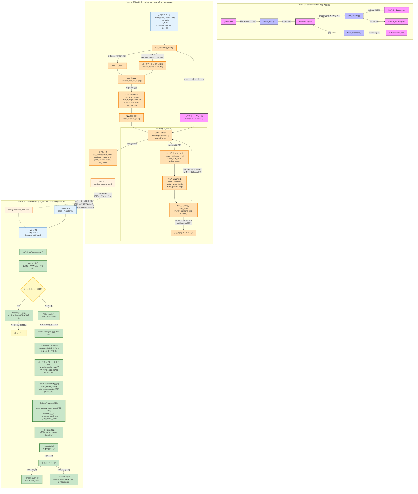

# 詳細なフローチャート図

本システムにおける**「オフラインHPO（探索フェーズ）」→「オンライン学習フェーズ」**の二段階構成、Step Lawに基づく探索空間構築、プロキシ学習による多次元最適化、Hydra設定合成による学習即時実行までの全ライフサイクルを表したフローチャートです。



---

## 凡例・色分け

| 色 | 意味 |
|---|---|
| 🟦 青 | 通常プロセス |
| 🟧 オレンジ | **HPOフェーズ** (optuna依存、開発時のみ実行) |
| 🟩 緑 | **学習フェーズ** (本番依存のみ、即時実行) |
| 🟨 黄 | 成果物・アーティファクト (Git管理) |
| 🟪 紫 | 設定・コンフィグ |
| 🟨 黄緑 | データ |

## キーポイント

1. **フェーズ完全分離**: HPO(`optuna`)と本番学習(`Trainer`)の依存関係ゼロ
2. **Step Law Prior**: Chinchilla/μP則から探索中心を計算、探索空間を定義
3. **効率的なデータ処理**: HPO実行前にメモリ上でデータセットを一括トークナイズし、各試行のオーバーヘッドを削減
4. **プロキシ学習**: 50ステップ・0.1%データで高速評価。ディスク容量節約のため、試行終了時にチェックポイントディレクトリを自動削除
5. **整合性検証 (ADR)**: 再開(resume)時、チェックポイント内の `hashes.json` と現在の設定/データセットハッシュを比較し、設定のドリフトを完全に検知・防止
6. **リソース自動調整**: 実行マシンのCPU論理コア数および空きRAM容量から、最適なトークナイズの並列プロセス数 `num_proc` を動的に決定
7. **成果物管理**: 生成された `hparams_XXX.yaml` はGitコミット対象とし、実行時の設定再現性を担保
8. **オンザフライシーケンスパッキング & 最適化 (ADR-0026, ADR-0027)**: パディング無しのトークン化後に `PackedDatasetWrapper` で動的パッキングを実施し、計算効率を最大化。さらに SDPA (Scaled Dot Product Attention) および Fused AdamW オプティマイザの適用で VRAM/計算速度を最適化。

```